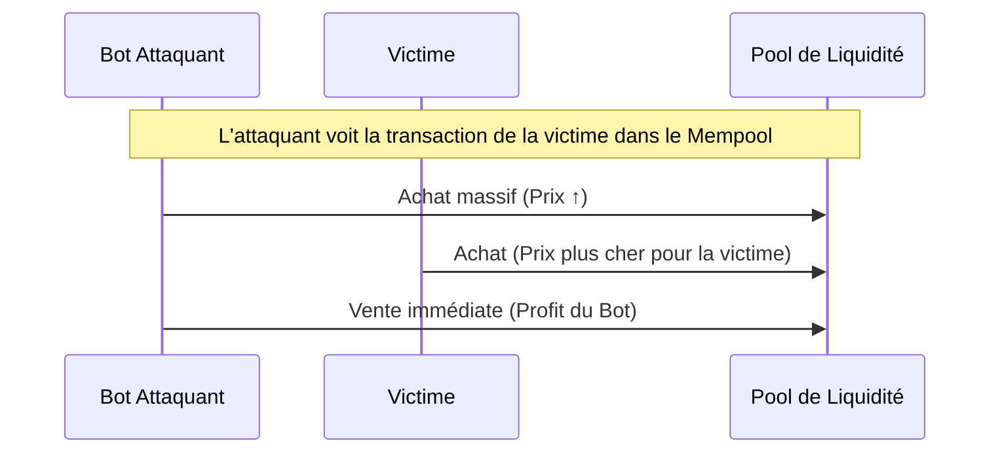
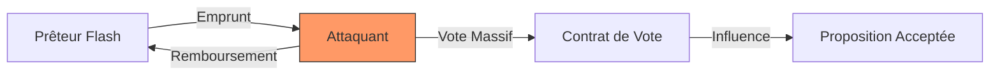

# 🔍 Analyse Forensique : Étude de Transactions sur l'EVM

> **Projet :** Blockchain & Smart Contracts  
> **Auteurs :** Charifa Dreoui & Safae Karkach  
> **Encadrant :** M. Khalid Boukhdir  
> **Année Académique :** 2025 - 2026

---

## 📑 1. Introduction
Ce rapport présente une analyse approfondie de cinq transactions réelles sur le réseau Ethereum. L'objectif est de comprendre le comportement interne de l'Ethereum Virtual Machine (EVM), d'analyser les structures de coûts (gas) et d'identifier les vecteurs d'attaque potentiels.

---

## 📊 2. Analyse des Transactions

### 📌 Transaction 1 : Transfert de jetons (ERC-20 USDT)
- **Hash :** `0x4e3abc2a5...`
- **Action :** Transfert de Tether USD.
- **Gas utilisé :** 63,221
- **Analyse Technique :**
  - Le coût élevé est dû à deux opérations **SSTORE** (20,000 gas chacune si l'emplacement est modifié).
  - Mise à jour du mapping `balanceOf` pour l'expéditeur et le destinataire.
- **Scénario d'Attaque :** **Phishing d'adresse zéro.** Un attaquant envoie 0 jeton d'une adresse similaire pour tromper l'utilisateur dans son historique.

---

### 📌 Transaction 2 : Swap sur DEX (Uniswap V3)
- **Action :** Échange de ETH contre USDC.
- **Gas utilisé :** ~135,000
- **Analyse Technique :**
  - Usage intensif de mathématiques complexes pour calculer les ticks de prix.
  - Multiples appels inter-contrats (**DELEGATECALL**).
- **Scénario d'Attaque :** **Attaque Sandwich.** Un bot achète juste avant vous et revend juste après pour capturer le slippage.

---

### 📌 Transaction 3 : Mentage de NFT (NFT Mint)
- **Action :** Création d'un nouveau token ERC-721.
- **Gas utilisé :** ~185,000
- **Analyse Technique :**
  - Initialisation de nouvelles variables de stockage pour l'ID du token et son propriétaire.
  - Émission de l'événement `Transfer`.
- **Scénario d'Attaque :** **Exploit de Reentrance.** Si le contrat appelle un hook `onERC721Received` sans protection, l'attaquant peut minter plus de jetons que prévu.

---

### 📌 Transaction 4 : Vote de Gouvernance (DAO)
- **Action :** Vote pour une proposition sur Compound Finance.
- **Gas utilisé :** ~78,000
- **Analyse Technique :**
  - Vérification du poids de vote (Snapshot de solde).
  - Écriture d'un booléen dans le stockage.
- **Scénario d'Attaque :** **Gouvernance Flash Loan.** Emprunt massif de tokens pour voter une proposition malveillante dans une seule transaction.

---

### 📌 Transaction 5 : Déploiement de Contrat Intelligent
- **Action :** Création d'un nouveau Smart Contract (`CREATE`).
- **Gas utilisé :** 1,200,000+
- **Analyse Technique :**
  - Coût fixe de 32,000 gas + 200 gas par octet de bytecode déployé.
- **Scénario d'Attaque :** **Contrat Malveillant.** Déploiement d'un contrat apparemment honnête mais contenant une fonction `selfdestruct` cachée ou une porte dérobée.

---

## 🧹 3. Synthèse des Coûts On-chain

| Opération EVM | Coût (Gas) | Description |
| :--- | :--- | :--- |
| **SSTORE** | 20,000 | Écriture dans une variable d'état (nouvelle) |
| **SLOAD** | 2,100 | Lecture d'une variable d'état |
| **LOG1-4** | 375 + | Émission d'un événement (Audit) |
| **CALL** | 2,600 | Appel vers un autre contrat |

---

## 🏁 4. Conclusion
L'analyse forensique montre que le stockage est la ressource la plus précieuse sur Ethereum. Une conception efficace doit minimiser les accès permanents et privilégier la logique de calcul ou les logs pour les données historiques.
