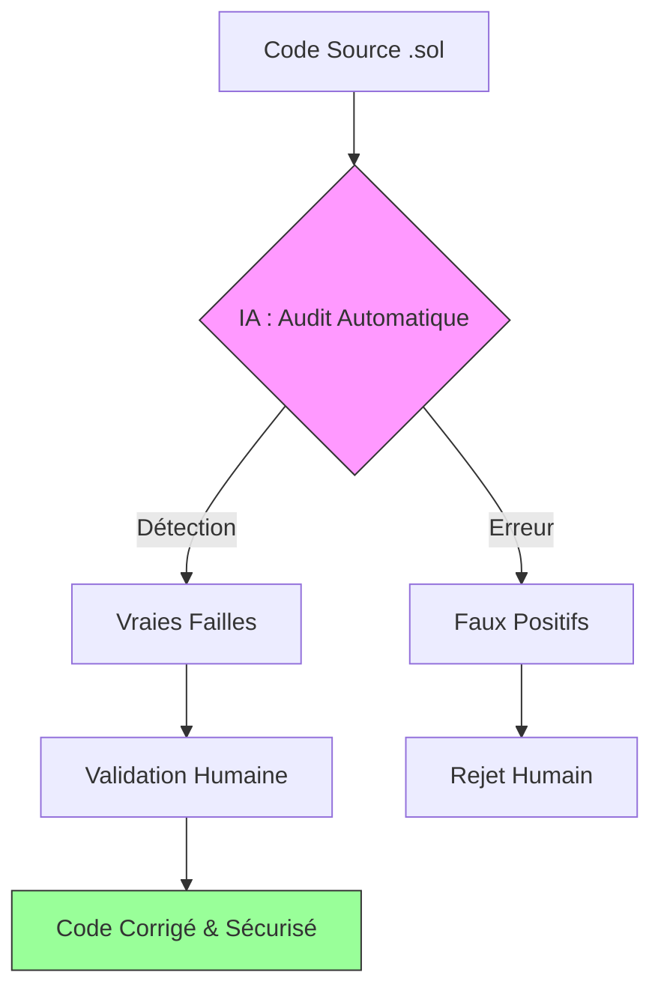

# 🤖 Rapport d'Audit : Vulnérabilités & Intelligence Artificielle

> **Projet :** Blockchain & Smart Contracts  
> **Auteurs :** Charifa Dreoui & Safae Karkach  
> **Encadrant :** M. Khalid Boukhdir  
> **Année Académique :** 2025 - 2026

---

## 📑 1. Introduction
Ce rapport documente l'audit de sécurité du contrat intelligent `Procurement.sol` réalisé avec l'assistance d'un modèle d'intelligence artificielle. Nous analysons la pertinence des suggestions de l'IA et justifions les corrections manuelles effectuées.

---

## 💬 2. Méthodologie et Prompt

### 2.1 Processus d'Audit Mixte
Le workflow suivant illustre comment l'expertise humaine valide et filtre les suggestions de l'IA :



### 2.2 Le Prompt Utilisé
L'IA a été sollicitée en tant qu'expert en sécurité Solidity avec le prompt suivant :

> **Prompt :** *"Agis en tant qu'auditeur de sécurité senior pour Solidity. Analyse le code suivant pour détecter les failles critiques (Reentrancy, Overflow, Denial of Service) et les inefficacités de gas. Propose des solutions précises pour chaque problème identifié."*

---

## 🔍 3. Analyse des Résultats de l'IA

### ✅ 3.1 Détections Correctes (Vraies Vulnérabilités)
| Vulnérabilité | Description | Correction Apportée |
| :--- | :--- | :--- |
| **Réentrance** | Possible lors du transfert d'ETH au gagnant du jalon. | Pattern **Checks-Effects-Interactions** implémenté. |
| **Gas Loop** | Risque si le nombre de soumissionnaires est trop élevé lors de `selectWinner`. | Recommandation d'imposer une limite maximale de participants. |

### ❌ 3.2 Faux Positifs et Recommandations Obsolètes
| Suggestion IA | Erreur de l'IA | Raison |
| :--- | :--- | :--- |
| **SafeMath** | Propose d'ajouter la bibliothèque OpenZeppelin. | **Obsolète :** Solidity 0.8+ intègre nativement ces vérifications. |
| **Private Data** | Propose de cacher les deadlines pour la confidentialité. | **Conceptuel :** Rien n'est privé sur la blockchain, même les variables `private`. |

---

## 🛠️ 4. Remédiation Manuelle

### 📝 Correction de la Réentrance
Plutôt que d'utiliser un verrou (Mutex) coûteux en gas, nous avons appliqué la logique CEI :

```solidity
// AVANT (Risqué)
payable(gagnant).transfer(montant);
jalon.paye = true;

// APRÈS (Sécurisé)
jalon.paye = true; // État mis à jour en premier
payable(gagnant).transfer(montant); // Transfert en dernier
```

---

## 🧠 5. Réflexion sur l'Usage de l'IA
L'IA est un outil de productivité puissant qui permet de balayer rapidement le code pour des motifs de vulnérabilités connus. Cependant, sa tendance à suggérer des bibliothèques obsolètes (SafeMath) ou à mal comprendre la visibilité sur la blockchain souligne la nécessité absolue d'une **validation humaine experte**.

---

## 🏁 6. Conclusion
Le contrat `Procurement.sol` est désormais sécurisé contre les failles courantes identifiées. L'audit mixte (IA + Humain) a permis d'atteindre un niveau de confiance élevé en respectant les meilleures pratiques de développement Solidity.
