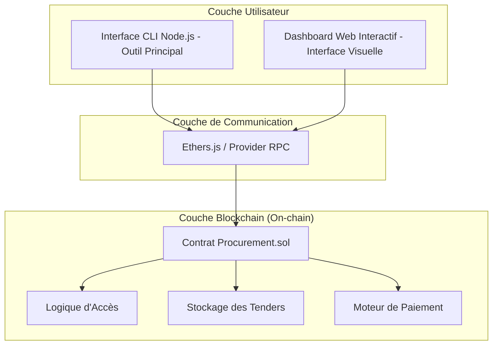
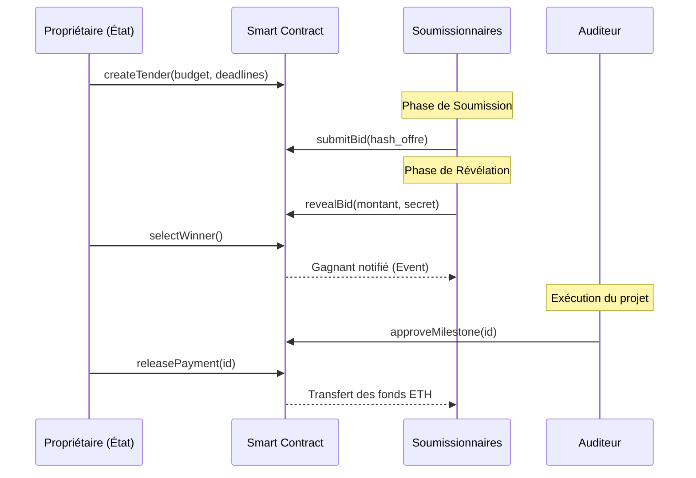
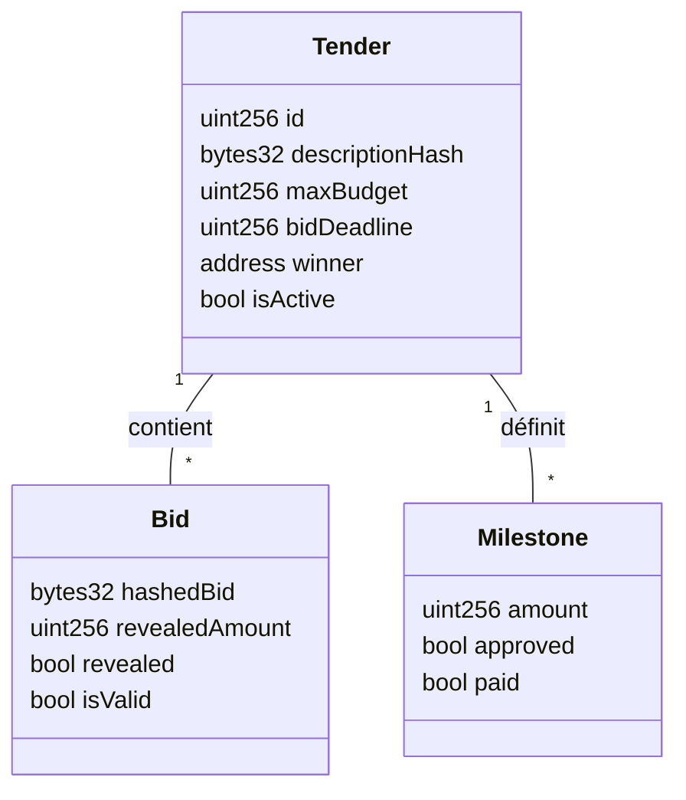

# 🏛️ Rapport Technique : Système Décentralisé de Suivi des Marchés Publics

> **Projet :** Blockchain & Smart Contracts  
> **Auteurs :** Charifa Dreoui & Safae Karkach  
> **Encadrant :** M. Khalid Boukhdir  
> **Année Académique :** 2025 - 2026

---

## 📖 1. Introduction

Ce rapport détaille la conception technique et l'implémentation d'un système de suivi des marchés publics basé sur la blockchain Ethereum. L'objectif principal est de résoudre les problèmes de corruption et d'opacité inhérents aux systèmes de passation de marchés traditionnels en utilisant des **Smart Contracts** pour automatiser et sécuriser chaque phase du processus.

---

## 🏗️ 2. Architecture du Système

### 2.1 Architecture Logicielle (Composants)
Le système est divisé en trois couches principales assurant la séparation des préoccupations :

### 2.2 Flux de Travail (Diagramme de Séquence)
Voici le parcours complet, de la création de l'appel d'offres au paiement final :

### 2.3 Machine à États (State Machine)
La sécurité du contrat repose sur une transition d'états immuable :

```mermaid
stateDiagram-v2
    direction LR
    [*] --> Ouvert : createTender
    Ouvert --> Soumission : block.timestamp < deadline
    Soumission --> Révélation : block.timestamp > deadline
    Révélation --> Sélection : revealDeadline atteinte
    Sélection --> Exécution : Gagnant choisi
    Exécution --> Terminé : Tous jalons payés
    Terminé --> [*]
```

---

## 📊 3. Structure des Données (Modèle)

Le contrat organise l'information via des structures de données optimisées :

### 3.1 Schéma "Commit-Reveal"
Pour garantir que les soumissionnaires ne voient pas les offres de leurs concurrents, nous utilisons un schéma de hachage cryptographique :

> [!IMPORTANT]
> **Formule du Hash :** `keccak256(montant, nonce_secret)`
> 1. **Phase Commit :** Seul le hash est envoyé au contrat.
> 2. **Phase Reveal :** Le soumissionnaire envoie son montant et son nonce. Le contrat vérifie que `hash(montant, nonce) == hash_stocké`.

### 3.2 Protection contre la Réentrance
La fonction `releasePayment` est vulnérable si elle n'est pas protégée.
- **Solution :** Utilisation du pattern **Checks-Effects-Interactions (CEI)**.
- **Détail :** Le statut `milestone.paid = true` est mis à jour *AVANT* le transfert des fonds.

---

## ⛽ 4. Analyse et Optimisation du Gas

Nous avons optimisé le contrat pour réduire les coûts de transaction :

| Opération | Coût estimé (Gas) | Remarques |
| :--- | :--- | :--- |
| `createTender` | ~150,000 | Coût de stockage initial élevé (SSTORE) |
| `submitBid` (Commit) | ~65,000 | Une seule écriture de hash |
| `revealBid` | ~45,000 | Vérification cryptographique |
| `selectWinner` | ~80,000+ | Dépend du nombre de soumissionnaires (Boucle) |

> [!TIP]
> **Optimisation :** L'usage d'événements (`emit`) pour l'historique d'audit au lieu de stocker des chaînes de caractères complexes permet une économie substantielle de gas.

---

## 🛠️ 5. Choix de Conception Technique

- **Solidity 0.8.19 :** Utilisation des versions récentes pour bénéficier du check d'overflow natif (éliminant le besoin de SafeMath).
- **Mappings vs Arrays :** Les soumissionnaires sont suivis via un tableau pour permettre l'itération lors de la sélection du vainqueur, tandis que les détails des offres sont stockés dans un `mapping` pour un accès O(1).
- **Rôle d'Auditeur :** Un audit externe est simulé par une adresse dédiée qui doit valider chaque jalon avant tout paiement.

---

## 🏁 6. Conclusion
Le système `Procurement` fournit une base technique robuste pour la gouvernance numérique. En automatisant la sélection du vainqueur et les paiements, nous minimisons l'intervention humaine et, par extension, les risques de fraude.
